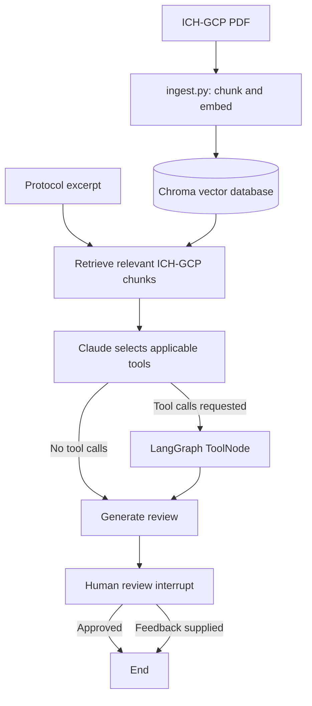

# Clinical Trial Protocol Compliance Reviewer

A bounded, human-in-the-loop, agentic RAG workflow for drafting ICH-GCP compliance reviews of clinical-trial protocol excerpts. The workflow retrieves relevant guideline text, runs selected deterministic checks, and uses Claude to synthesize an evidence-aware draft for human approval.

> This project is a decision-support prototype. It is not a substitute for qualified clinical, regulatory, or legal review, and it must not make final compliance decisions autonomously.

## What it does

Given a protocol excerpt, the application:

1. Retrieves the five most similar ICH-GCP chunks from a local Chroma vector database.
2. Lets Claude select applicable deterministic compliance checks.
3. Runs the requested checks through LangGraph's `ToolNode`.
4. Produces a structured report using the retrieved guideline text and tool results.
5. Pauses for a human reviewer to approve the draft or provide feedback.

## Architecture



## Technology

| Purpose | Technology |
| --- | --- |
| LLM and tool selection | Claude via `langchain-anthropic` |
| Workflow orchestration and human interrupt | LangGraph |
| RAG integration | LangChain |
| Embeddings | `BAAI/bge-base-en-v1.5` via `langchain-huggingface` |
| Vector database | Chroma |
| Source guideline | ICH E6(R3) draft guideline PDF |

## Deterministic tools

Claude can choose from these Python tools. Their outputs are deterministic for the same input text:

- `check_informed_consent`: flags verbal-only consent and checks for written consent.
- `check_sae_reporting`: flags a 30-day serious-adverse-event reporting timeline.
- `check_eligibility`: checks for inclusion and exclusion criteria.

The report includes the exact names and outputs of the tools that were executed.

## Setup

Use Python 3.10+ and install the project dependencies:

```powershell
python -m venv venv
.\venv\Scripts\Activate.ps1
pip install langchain-anthropic langchain-community langchain-core langchain-huggingface langgraph chromadb pypdf python-dotenv sentence-transformers
```

Create a `.env` file in the project root:

```env
ANTHROPIC_API_KEY=your_anthropic_api_key
```

The API key is excluded from Git by `.gitignore`.

## Build the local guideline index

1. Download the [official ICH E6(R3) draft guideline PDF](https://database.ich.org/sites/default/files/ICH_E6%28R3%29_DraftGuideline_2023_0519.pdf).
2. Save it in the project root as `ICH_E6(R3)_DraftGuideline_2023_0519.pdf`.
3. Run:

```powershell
python ingest.py
```

This loads the PDF, splits it into overlapping 1,000-character chunks, embeds the chunks with BGE, and stores them under `chroma_db/`. The PDF is deliberately not included in this repository; download it directly from ICH and verify the document version before use.

## Run the reviewer

```powershell
python agent.py
```

The script prints the draft report and waits for approval. Enter `y` to approve it, or `n` and reviewer comments to reject it.

## Scope and known limitations

- **No revision loop yet:** reviewer feedback is recorded in graph state, but the current graph ends rather than asking Claude to revise the report.
- **Prompt-level grounding only:** the prompt instructs Claude to use only retrieved ICH-GCP text, but there is no programmatic citation validator to prevent unsupported findings.
- **Fixed retrieval strategy:** every review retrieves `k=5` chunks using similarity search; there is no reranking, relevance threshold, or retrieval-quality evaluation.
- **LLM-directed tool selection:** Claude may choose not to call a tool. Critical checks should be routed deterministically if they must always run.
- **Limited rules:** the three checks are simple keyword-based prototypes and do not cover the breadth or nuance of ICH-GCP compliance.
- **No durable agent memory:** `InMemorySaver` preserves state only while the process is running, chiefly to support pause/resume. It is not persistent cross-review memory.
- **No production controls:** this prototype does not include authentication, access controls, encryption, audit logging, evaluation suites, or clinical validation.
- **Guideline versioning:** reviews depend on the indexed source document. The guideline version and source should be tracked explicitly in a production system.

## Suggested next steps

1. Add chunk IDs and require every finding to cite retrieved evidence.
2. Validate findings against retrieved chunks and relevant tool outputs before human review.
3. Route rejected reports back to a revision node with reviewer feedback.
4. Add focused rule sets and tests for additional ICH-GCP domains.
5. Replace in-memory checkpointing with secure persistent storage if the application needs durable review histories.

## Repository hygiene

Generated vector data, local virtual environments, the `.env` file, and the generated graph image are ignored by Git. Do not commit API keys or confidential protocol material. Confirm that the guideline document may be redistributed before publishing it in a public repository.
