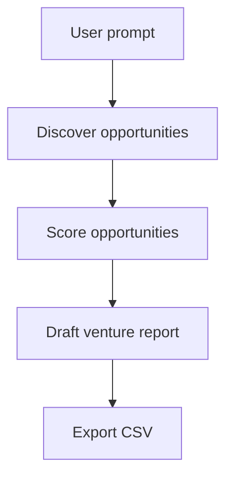

# Venture Scout Agent

A LangGraph-based agent that scouts sustainability and decarbonization technologies in Europe, scores them against a founder profile, and exports a ranked list for further venture analysis.

## What it does

Given a high-level prompt, the workflow:

1. Loads a curated set of decarbonization opportunities from a local JSON file.
2. Scores each opportunity for founder fit, climate impact, market attractiveness, Europe readiness, and capital efficiency.
3. Uses Claude to synthesize a compact venture memo and recommend whether to start with one orchestrator agent or a multi-agent system.
4. Writes a CSV file that can be imported into Google Sheets or other tooling.

## Architecture



## Technology

| Purpose | Technology |
| --- | --- |
| LLM synthesis | Claude via `langchain-anthropic` |
| Workflow orchestration | LangGraph |
| Data source | Local JSON seed file |
| Output | CSV for Google Sheets import |

## Setup

Use Python 3.10+ and install the project dependencies:

```powershell
python -m venv venv
.\venv\Scripts\Activate.ps1
pip install langchain-anthropic langchain-core langgraph python-dotenv
```

Create a `.env` file in the project root:

```env
ANTHROPIC_API_KEY=your_anthropic_api_key
```

## Run the scout

```powershell
python agent.py
```

The script writes ranked opportunities to `opportunities.csv` and prints a short report.

## Seed the opportunity list

```powershell
python ingest.py
```

This validates and rewrites the opportunity seed file from `opportunities.json`.

## Next steps

1. Replace the static seed list with live data from university tech transfer offices, patent databases, and EU project portals.
2. Add a Google Sheets export step using a service account.
3. Add a second pass that enriches each opportunity with customer interviews, competitor mapping, and funding environment.
4. Move from one orchestrator agent to a small multi-agent setup once the data pipeline is reliable.
